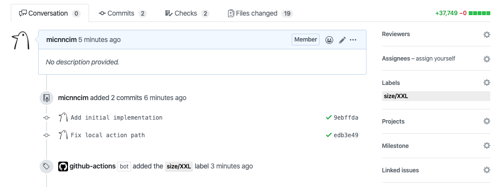
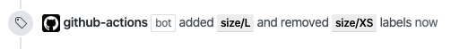

# Action Size

[![actions-workflow-test][actions-workflow-test-badge]][actions-workflow-test]
[![release][release-badge]][release]




Determine a label to be added based on the number of lines changed in a pull request.

Counts the number of lines changed in a pull request.
And buckets this number into a few size classes (S, L, XL, etc).

It would be better to work with other actions which add and remove labels.
See [the example below](#Example) for detail.

This action is inspired by [Kubernetes Prow's size plugin](https://prow.k8s.io/plugins).

## Prerequisites

You need to create labels indicating a pull request size.
The description about the kinds of labels are below.

## Inputs

All the inputs are optional.

### Size labels

The inputs `size_${size}_label` indicates what name each label has.

|       Name       |  Type  |         Description          |  Default   |
| ---------------- | ------ | ---------------------------- | ---------- |
| `size_xs_label`  | string | The name for size XS label.  | `size/XS`  |
| `size_s_label`   | string | The name for size S label.   | `size/S`   |
| `size_m_label`   | string | The name for size M label.   | `size/M`   |
| `size_l_label`   | string | The name for size L label.   | `size/L`   |
| `size_xl_label`  | string | The name for size XL label.  | `size/XL`  |
| `size_xxl_label` | string | The name for size XXL label. | `size/XXL` |

### Size thresholds

The inputs `size_${size}_threshold` indicates how many lines changed is corresponding to each label.
Must be a maximal number, rather than a range.

|         Name         |  Type  |         Description         | Default |
| -------------------- | ------ | --------------------------- | ------- |
| `size_s_threshold`   | number | The threshold for size S.   | `10`    |
| `size_m_threshold`   | number | The threshold for size M.   | `30`    |
| `size_l_threshold`   | number | The threshold for size L.   | `100`   |
| `size_xl_threshold`  | number | The threshold for size XL.  | `500`   |
| `size_xxl_threshold` | number | The threshold for size XXL. | `1000`  |

## Outputs

|      Name      |  Type  |                                             Description                                              |
| -------------- | ------ | ---------------------------------------------------------------------------------------------------- |
| `new_label`    | string | The new label's name to be added.                                                                    |
| `stale_labels` | string | The stale labels' name to be removed. If there're multiple labels, they're separated by line breaks. |

## Example

This action works well with [actions-ecosystem/action-add-labels](https://github.com/actions-ecosystem/action-add-labels) and [actions-ecosystem/action-remove-labels](https://github.com/actions-ecosystem/action-remove-labels).

```yaml
name: Size

on:
  pull_request:
    types: [opened, synchronize]

jobs:
  update_labels:
    runs-on: ubuntu-latest
    steps:
      - uses: actions/checkout@v2
      - uses: actions-ecosystem/action-size@v2
        id: size
      - uses: actions-ecosystem/action-remove-labels@v1
        with:
          github_token: ${{ secrets.github_token }}
          labels: ${{ steps.size.outputs.stale_labels }}
      - uses: actions-ecosystem/action-add-labels@v1
        with:
          github_token: ${{ secrets.github_token }}
          labels: ${{ steps.size.outputs.new_label }}
```

## License

Copyright 2020 The Actions Ecosystem Authors.

Action Size is released under the [Apache License 2.0](./LICENSE).

<!-- badge links -->

[actions-workflow-test]: https://github.com/actions-ecosystem/action-size/actions?query=workflow%3ATest
[actions-workflow-test-badge]: https://img.shields.io/github/workflow/status/actions-ecosystem/action-size/Test?label=Test&style=for-the-badge&logo=github

[release]: https://github.com/actions-ecosystem/action-size/releases
[release-badge]: https://img.shields.io/github/v/release/actions-ecosystem/action-size?style=for-the-badge&logo=github
